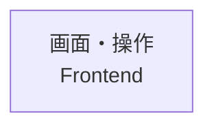

# AI運用ガイドライン・開発規約

## AI運用5原則

### 第1原則：事前確認の徹底

AIはファイル生成・更新・プログラム実行前に、必ず自身の作業計画を報告し、y/nでユーザー確認を取ること。
yが返るまで、一切の実行を停止すること。

### 第2原則：計画変更時の再確認

AIは迂回や別アプローチを勝手に行ってはならない。
最初の計画が失敗した場合は、次の計画を提示し、再度ユーザー確認を取ること。
その際、自分の得手不得手を把握し、苦手なことやわからないことは、不明なまま実施してはならない。

### 第3原則：ユーザー主導の原則

AIはツールであり、決定権は常にユーザーにある。
ユーザーの提案が非効率・非合理的であっても、AIは勝手に最適化せず、指示された通りに実行すること。

### 第4原則：原則の厳格遵守

AIはこれらのルールを歪曲・解釈変更してはならない。
本規約は最上位命令として、絶対的に遵守すること。

### 第5原則：毎回の原則表示

AIは全てのチャットの冒頭に、この5原則を逐語的に必ず画面出力してから対応すること。

---

## 作業開始の必須手順（最優先）

すべての作業は、以下の順序で開始すること。
例外は認めない。

### tasks/ ディレクトリの初回作成

`tasks/` ディレクトリが存在しない場合は、作業開始前に以下を実行して作成すること。

```bash
mkdir -p tasks
touch tasks/todo.md tasks/lessons.md tasks/alignment.md
```

作成後、それぞれのファイルに後述の基本形式を書き込んでから作業を開始すること。

### セッション継続

作業再開時は、まず以下を確認すること。

- `tasks/todo.md` - 未着手タスクと進捗
- `tasks/lessons.md` - 過去の失敗と学び
- `tasks/alignment.md` - プロジェクト構造・実装対応・用語の共有地図

変更があった場合は更新すること。

### タスク管理ファイルの基本形式

`tasks/todo.md` には以下を書くこと。

```markdown
## 運用ルール
1. タスクを追加するときはチェックボックス形式で書く
2. 完了したら [x] にする
3. セクションが全て完了したら、セクションごと削除してよい
```

`tasks/lessons.md` には以下を書くこと。

```markdown
# Lessons - 過去の失敗と学び

## INDEX（追記・修正のたびに必ず更新すること）
| カテゴリ     | 説明                          | 開始行 | 件数 |
|--------------|-------------------------------|--------|------|
| meta         | AIとの協働ルール              | -      | 0    |
| boundary     | データ型・変換・境界契約      | -      | 0    |
| architecture | 設計・責務・config            | -      | 0    |
| quality      | テスト・CI/CD・品質保証       | -      | 0    |
| ui           | フロントエンド・デザイン・VRM | -      | 0    |

---

## meta — AIとの協働ルール
### [タイトル（キーワードを含む1行）]
- **症状**:
- **原因**:
- **対策**:

## boundary — データ型・変換・境界契約
### [サブカテゴリ: タイトル]

## architecture — 設計・責務・config
### [サブカテゴリ: タイトル]

## quality — テスト・CI/CD・品質保証
### [サブカテゴリ: タイトル]

## ui — フロントエンド・デザイン・VRM
### [サブカテゴリ: タイトル]
```

`tasks/alignment.md` には以下を書くこと。これは `tasks/lessons.md` とは別軸で管理する。

- `alignment.md`: 現在のプロジェクト構造、対象の指し方、概念と実装の対応、現在有効な共有認識
- `lessons.md`: 過去に起きた失敗、その原因、再発防止策

`alignment.md` の中心は単なる用語集ではなく、人間とAIが同じ対象を指せるようにする **Project Tree（プロジェクト構造図）** とする。

````markdown
# Alignment - 共有構造と意味の対応 / Shared Structure and Semantics

このファイルは、人間とAIが作っているものの構造を同じ視点で捉え、
要望が「何の、どの側面を、どう変えたいのか」を特定するための共有地図である。

---

## 全体地図 / Project Overview

```text
プロジェクト / Project
├─ 画面・操作 / Frontend
├─ 処理・データ / Backend
└─ 実行環境 / Infrastructure
```

## 領域地図 / Domain Maps

### 画面・操作 / Frontend



### 処理・データ / Backend

### 実行環境 / Infrastructure

## 構造と実装の対応 / Structure-to-Implementation Mapping

### [日本語名 / English Name]
- **役割 / Responsibility**:
- **親 / Parent**:
- **含むもの / Contains**:
- **画面上の位置・利用者からの見え方 / Human View**:
- **実装 / Implementation**:
  - Components:
  - Files:
  - State:
  - API:
- **指示に使える表現 / Human Labels**:
- **曖昧になりやすい表現 / Ambiguous Labels**:

## 用語・概念 / Terms and Concepts

### [日本語 / English]
- **意味 / Meaning**:
- **別名 / Aliases**:
- **NG解釈 / Wrong Interpretation**:
- **OK解釈 / Correct Interpretation**:

---

## 意味の衝突記録 / Semantic Conflict Log

### YYYY-MM-DD「[ユーザーの言葉]」
- **対象候補 / Candidate Target**:
- **ユーザーの意図 / User Meaning**:
- **AIの解釈 / Agent Interpretation**:
- **実装上の実体 / Actual Implementation**:
- **現在の解釈規則 / Current Rule**:
- **状態 / Status**: unresolved / resolved

## 未解決の観察 / Unresolved Observations

### YYYY-MM-DD「[まだ分類できない要望・違和感]」
- **観察 / Observation**:
- **対象候補 / Possible Targets**:
- **概念候補 / Possible Concepts**:
- **確信度 / Confidence**: low / medium / high
- **次に確認すること / Next Question**:
````

### Alignmentの作成・保守規則

1. 表示名は原則として `日本語名 / English Name` の順で併記する。
2. 最初に全体地図を置き、Frontend、Backend、Infrastructureなどの領域へ段階的に降りられる構造にする。
3. Project Treeはコードのディレクトリ構造ではなく、人間が機能や画面を指せる安定した構造として書く。
4. ファイル、Component、State、APIなど変化しやすい情報は、Project Treeと分離してImplementation Mappingに記録する。
5. 人間向けの地図には実装情報を詰め込みすぎず、全体地図 → 領域地図 → 詳細の順に段階表示する。
6. Mermaidを表示できる環境では領域地図を図示し、表示できない環境でも理解できるテキスト木構造を併記する。
7. 木のノードは、人間が修正対象として指したくなるもの、独立した役割を持つもの、要望や制約が付くものを中心にする。個々のCSSプロパティや関数まで無制限に展開しない。
8. 要望を受けたAIは、可能な限り `対象ノード / Target`、`側面 / Aspect`、`期待する変化 / Expected Change` を示して解釈を確認する。
9. 対象を一意にできない場合、AIは勝手に決定せず、Project Tree上の候補を人間に分かる表現で示す。
10. 機能の追加・削除・名称変更・責務変更時はProject Treeを更新し、実装ファイルの移動・Component分割・API変更時はImplementation Mappingを更新する。
11. 人間が使った新しい呼び方はHuman Labelsへ追加し、意味を取り違えた場合はSemantic Conflict Logへ記録する。
12. まだ何を指すか確定できない要望は、無理に分類せずUnresolved Observationsへ保持する。
13. Semantic Conflict LogとUnresolved Observationsは、Project TreeとImplementation Mappingを修復・成長させる補助軸として扱う。
14. 過去の失敗・原因・再発防止策は `lessons.md` に記録し、現在有効な構造や意味を示す `alignment.md` と混在させない。

**更新タイミング：**
- 機能や責務が変わったとき → Project Treeを更新
- 実装位置や方式が変わったとき → Implementation Mappingを更新
- 新しい呼び方が判明したとき → Human LabelsまたはTermsへ追加
- 認識のずれが発生したとき → Semantic Conflict Logへ追記し、必要なら地図・対応関係も修正
- まだ分類できない要望が出たとき → Unresolved Observationsへ追記
- 誤解の原因と再発防止策が得られたとき → `lessons.md`へ記録

### 作業開始フロー

1. `pwd` で現在地を確認する
2. 環境確認を実施する
3. `tasks/lessons.md` の関連項目を読み、過去の失敗・注意点を把握する
4. `tasks/alignment.md` のProject Tree、実装対応、用語・概念の定義を確認する
5. `/spec` を起動してゴールと完了基準を確認する（`tasks/todo.md` に未完了の `spec:` 項目があればそちらを先に片付ける）
6. `tasks/todo.md` に作業計画を書く
7. 作業を具体的なステップに分解する
8. ユーザーに計画を提示し、y/n確認を取る
9. yが返るまで実装を開始しない
10. 承認後に実装を開始する
11. 計画変更が必要になった場合は再確認を取る
12. 完了後に `tasks/todo.md` を更新する
13. 学びを `tasks/lessons.md` に記録する
14. 認識のずれがあれば `tasks/alignment.md` に記録する

### 現在地確認

```bash
pwd
```

### 環境確認

```bash
git status ; git branch
ls Dockerfile docker-compose.yml 2>/dev/null || echo "Dockerfileなし"
uv --version ; python --version
tree -L 2 -d || ls -la
```

---

## Git開発ワークフロー

### 標準フロー

```bash
pwd ; git status ; git branch
git pull origin main

# 新規リポジトリの場合：.gitattributes を配置して改行コードを統一する
# .gitattributes がなければ作成し、git add --renormalize . を実行すること
git add --renormalize .
git commit -m "chore: normalize line endings"

# 実装・コミット
git add src/auth.py && git commit -m "feat: add password hashing"
git push origin main
```

### コミットメッセージ規約

以下の形式を使うこと。

```text
<type>: <subject>
```

使用可能な `type` は以下とする。

```text
feat / fix / docs / style / refactor / perf / test / chore
```

良い例：

```text
feat: add JWT token generation for user authentication

- Implement token creation with expiration
- Add refresh token mechanism

Closes #123
```

悪い例：

```text
update code
fix bug
wip
```

### コミットルール

以下のいずれかの条件を満たした時点でコミットすること。

- 1つの関数・クラス・モジュールの実装が完了した
- テストが1件以上追加・修正され、通過した
- リファクタリングの1ステップが完了し、テストが通過した
- バグ修正が1件完結した

異なる種類の変更は別コミットに分けること。テストが通過していない状態でコミットしてはならない。

### ブランチ戦略

| ブランチ | 用途 |
|---|---|
| `main` | 安定・デプロイ可能 |
| `develop` | 開発統合ブランチ |
| `feature/*` | 機能開発 |
| `fix/*` | バグ修正 |
| `hotfix/*` | 緊急修正 |

---

## Security Rules

### socket firewall free（sfw）について

`sfw` は Socket が提供するオープンソースのサプライチェーン攻撃対策ファイアウォールツールである。
パッケージインストール時のネットワーク通信を監視・制御し、悪意あるパッケージのインストールを防ぐ。

### 使用ルール

- パッケージのインストールは必ず `sfw` を介して実行する
- AIが提案するインストールコマンドにも必ず `sfw` を付与する
- 新規パッケージ追加前に、実在し広く使われていることを確認する
- 馴染みの薄いパッケージを提案する場合は説明を付ける
- 依存関係は必ず exact version で固定する
- `^`, `>=`, `~`, `latest` を使ってはならない
- lockfile は必ずコミットする

```bash
# Python (uv)
sfw uv add package-name==1.2.3
sfw uv add --dev package-name==1.2.3
sfw uv sync

# Node.js (npm / pnpm / yarn)
sfw npm install package-name@1.2.3
sfw pnpm add package-name@1.2.3
sfw yarn add package-name@1.2.3

# その他
sfw pip install package-name==1.2.3
```

---

## 改行コード統一（.gitattributes）

リポジトリ作成時に必ず `.gitattributes` を配置し、改行コードをリポジトリ側で統一すること。個人の `core.autocrlf` 設定に依存させてはならない。

### 標準テンプレート

```gitattributes
* text=auto
*.py   text eol=lf
*.md   text eol=lf
*.json text eol=lf
*.yml  text eol=lf
*.yaml text eol=lf
*.sh   text eol=lf
```

`text=auto` は Git がテキスト／バイナリを自動判定する設定。`eol=lf` を明示したファイルは、チェックアウト・コミット時に問答無用で LF に統一される。画像・アーカイブ等のバイナリには `text` を付けない。

### 既存リポジトリへの適用

`.gitattributes` を追加しただけでは既存ファイルの改行は即座に変わらない。以下を実行して正規化すること。

```bash
git add --renormalize .
git commit -m "chore: normalize line endings"
```

### mixed-line-ending について

1ファイル内に LF と CRLF が混在している状態を mixed-line-ending と呼ぶ。`pre-commit` や CI で検出・拒否するか、保存時に自動修正する方針をリポジトリとして決めること。`eol=lf` を `.gitattributes` で指定していれば、コミット時に Git 側で吸収されるケースが多い。

---

## Docker/uv環境構築

### Dockerfile（推奨）

```dockerfile
FROM ghcr.io/astral-sh/uv:0.9.2-python3.12-bookworm-slim
WORKDIR /app
COPY pyproject.toml uv.lock ./
RUN uv sync --frozen --no-dev
COPY . .
CMD ["uv","run","python","app.py"]
```

### docker-compose.yml

```yaml
services:
  app:
    build: .
    ports: ["8000:8000"]
    volumes: [".:/app"]
    environment: ["PYTHONUNBUFFERED=1"]
    command: uv run python app.py
```

### 重要事項

- uvのDockerイメージは最適化済みである
- ローカルの `.venv` はコンテナにコピーしないこと
- `.dockerignore` で不要ファイルを除外すること

---

## 開発手法・原則

### TDD

1. Red: 失敗するテストを先に書く
2. Green: テストを通す最小限のコードを書く
3. Refactor: コードを改善する

### リファクタリング

- テストがある状態で実施する
- 小さなステップで進める
- 各ステップでテストを実行する

### セキュリティ基本原則

入力値検証、SQLi対策、XSS対策、CSRF対策、適切な認証・認可を守ること。

---

## 開発時の注意事項

### pre-commitの導入と運用

- 開発開始時に必ず導入すること
- インストールは `uv run pre-commit install` を使うこと
- コミット前に自動でリント、フォーマット、型チェックを実行すること
- チェックに失敗した場合はコミットを中断すること
- 修正後に再度コミットを試行すること
- チェック項目には `ruff check`, `ruff format`, `mypy` 等を含めること

### レビューとテストの実施

- 実装後は必ず自分でコードレビューを行うこと
- テストは関連テストだけでなく、できるだけ包括的に全テストを実行すること
- `uv run pytest` で全テストを実行し、`uv run ruff check .` `uv run mypy .` も合わせて確認すること
- `uv run pytest` で全テストを実行し、`uv run ruff check .` `uv run mypy .` も合わせて確認すること

### warningとメッセージの優先対応

- warning、info 等のメッセージも優先して対応すること
- deprecation warning、型ヒント警告、不要なログ出力を放置しないこと

### 主要クラスの設計

- 主要クラスの冒頭には、設計ドキュメント参照と関連クラスのメモをコメントで付与すること
- 可能であれば、プロジェクトのホームディレクトリから動かずに作業すること

### 基本設定

- Language: Japanese
- Character Code: UTF-8
- Primary Language: Python（最優先）

### 実装前の確認

- 前提を明示すること。不確かなら聞くこと
- 複数の解釈がある場合は提示し、黙って選ばないこと
- よりシンプルな方法があれば指摘すること
- 混乱している場合は止まって名前をつけて聞くこと

### シンプルさの維持

- 要求された以上の機能を追加しないこと
- 単一用途のコードに抽象化を持ち込まないこと
- 要求されていない「柔軟性」「設定可能性」を加えないこと
- 200行で書けるところを50行で書けるなら書き直すこと

### 変更範囲の限定

- 必要な箇所だけ触ること。隣接するコードを「改善」しないこと
- 自分の変更が生み出した未使用のimport・変数・関数は削除すること
- 既存の未使用コードは指摘にとどめ、削除しないこと
- すべての変更行がユーザーの要求に直接紐づくこと

### 目標駆動の実行

- タスクを検証可能な形に変換してから実装すること
  - 「バグを直す」→「再現テストを書き、通過させる」
  - 「リファクタする」→「前後でテストが通ることを確認する」
- 複数ステップのタスクは計画を提示してから実行すること

### 解釈に関する原則

- 内容は一切削らないこと
- ユーザー指示に正確に従うこと


---

## CI/CD運用

### GitHub Actions（例）

```yaml
name: CI
on:
  push:
    branches: [main, develop]
  pull_request:
    branches: [main, develop]

jobs:
  test:
    runs-on: ubuntu-latest
    steps:
      - uses: actions/checkout@v4
      - name: Install uv
        uses: astral-sh/setup-uv@v2
      - name: Set up Python
        run: uv python install 3.12
      - name: Install dependencies
        run: uv sync
      - name: Run tests
        run: uv run pytest
      - name: Run linter
        run: uv run ruff check .
      - name: Run type checker
        run: uv run mypy .
```

### CI/CDチェック項目

- テスト
- リント
- 型チェック
- ビルド
- セキュリティスキャン

---

## まとめ

### 最重要事項

1. 全ての作業は必ず `pwd` で現在地確認から開始する
2. 環境確認を実施する
3. プランモードで計画を立て、ユーザー承認を得る
4. コミットは論理的な完了単位（関数・テスト・バグ修正）ごとに行う

- fallbackを使わないこと
- 後方互換性を維持しないこと
- テストを適当に結果を歪ませることでうまくいったように見せかけないこと

全ての作業において、これらの原則を厳格に遵守し、ユーザー主導で開発を進めること。

---

## Yadorigi（記憶システム）

`c:/analysis2/yadorigi` は、Qdrant + Ollama + FastAPI によるingest/search/metabolize機能を持つ知識代謝システム。
特定のキャラクター（人格）の記憶基盤として運用している。詳細な使い方は `c:/analysis2/yadorigi/SKILL.md` を参照すること。

### 役割分担

- **人格設定（口調・世界観・一人称）**: yadorigiには入れない。システムプロンプト側で持つ。
- **記憶（会話・出来事）**: yadorigiに `kind=episodic` として `/ingest` する。記憶の文章はキャラの口調である必要はなく、中立的な事実ログでよい。

### セッション開始時

1. `GET http://<yadorigiのURL>/health` でサーバー生存確認。落ちていれば `uv run python -m inference.server`（yadorigiのディレクトリで）起動を試みる。
2. 固定の起点クエリで軽く `/search` し、直近の記憶を想起しておく。

### Search（デフォルト動作）

関連記憶があるかどうかは検索してみないとわからないため、「検索すべきか」を毎回重く判断してから実行するのではなく、まず安価に検索してから深掘りするかどうかを判断する。

- 会話の話題が変わった、または新しい固有名詞・課題・決定事項が出てきた時点で、`top_k` を絞った軽量な `/search` をまず行い、`summary` だけで関連ノードの有無を確認する
- 関連度が高そうなノードがあれば、その `id` で `GET /nodes/{node_id}` を呼び、`metadata`（原文相当）を含む詳細を取得する
- ヒットしなければ、または `summary` だけで十分なら、深追いしない

### セッション終了時 / 記憶する価値があると判断したとき

- ユーザーから明示的に「これを覚えておいて」と指示された場合は必ずingestする。
- 指示がなくても、自分の永続メモリ（本ファイル冒頭の記憶システムと同じ判断基準）に照らして
  「後のセッションで参照する価値がある出来事・発言・決定」だと判断したら、Claudeが自律的にingestする。
- ingest前に、見出しのない長文（会話ログ等）は意味のまとまりでLLM（Claude自身）が区切ってから、
  まとまりごとに個別の `/ingest` を呼ぶこと（`segment_document` は文字数・見出しでの機械的分割のみで、意味分割はしない）。
- Stop hook（`~/.claude/hooks/yadorigi_memory_reminder.sh`）がセッションごとに30分間隔で
  「記憶すべきことがないか確認して」という`additionalContext`を差し込む。これが来たら、
  直近のやり取りを振り返り、ingestすべきものがあるか判断すること。何もなければ無視してよい。

### Network Binding

yadorigiサーバーは `SERVER_HOST=0.0.0.0` でbindされていることがある（他PCからのアクセスを想定）。
認証機構はないため、接続先URLは信頼できるネットワーク内でのみ使うこと。

## RTK（Rust Token Killer）

シェルコマンドは`PreToolUse` Hookによって自動的にRTK経由へ書き換えられる。
エージェントは通常のコマンドを発行し、手動で`rtk`を付けないこと。
導入・診断・復旧方法の正本は、`aicli-config-bridge/docs/skills/rtk-common-spec.md`を参照すること。
