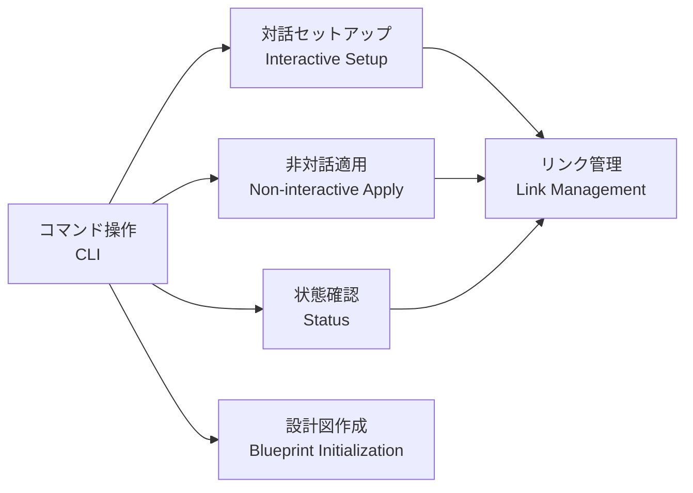
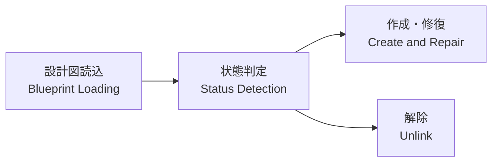

# Alignment - 共有構造と意味の対応 / Shared Structure and Semantics

このファイルは、人間とAIが同じプロジェクト構造を見ながら、変更対象を指せるようにする共有地図である。
過去の失敗と再発防止策は `tasks/lessons.md` に記録し、ここには現在有効な構造・実装対応・意味を記録する。

---

## 全体地図 / Project Overview

```text
AI CLI設定ブリッジ / AI CLI Config Bridge
├─ コマンド操作 / CLI
│  ├─ 対話セットアップ / Interactive Setup
│  ├─ 非対話適用 / Non-interactive Apply
│  ├─ 状態確認 / Status
│  └─ 設計図作成 / Blueprint Initialization
├─ リンク管理 / Link Management
│  ├─ 設計図読込 / Blueprint Loading
│  ├─ 状態判定 / Link Status Detection
│  ├─ 作成・修復 / Create and Repair
│  └─ 解除 / Unlink
├─ 設定資産 / Configuration Assets
│  ├─ リンク設計図 / Link Blueprint
│  ├─ 管理対象設定 / Managed Configurations
│  └─ 配置先参照 / Target References
└─ 開発基盤 / Development Foundation
   ├─ テスト / Tests
   ├─ ドキュメント / Documentation
   └─ CI・品質チェック / CI and Quality Checks
```

## 領域地図 / Domain Maps

### コマンド操作 / CLI



### リンク管理 / Link Management



## 構造と実装の対応 / Structure-to-Implementation Mapping

### コマンド操作 / CLI

- **役割 / Responsibility**: 人間またはAIからコマンドを受け取り、リンク管理処理へ接続する
- **実装 / Implementation**:
  - Files: `src/aicli_config_bridge/cli.py`
- **指示に使える表現 / Human Labels**: CLI、コマンド、対話メニュー、`setup`、`apply`、`status`、`init`
- **曖昧になりやすい表現 / Ambiguous Labels**: 「セットアップ」は環境構築ではなくリンク設定を指す場合がある

### リンク管理 / Link Management

- **役割 / Responsibility**: 設計図を読み、リンク状態の判定、作成、修復、解除を行う
- **実装 / Implementation**:
  - Files: `src/aicli_config_bridge/setup/manager.py`
  - Models: `src/aicli_config_bridge/setup/models.py`
- **指示に使える表現 / Human Labels**: リンク処理、リンク作成、状態判定、修復、解除
- **曖昧になりやすい表現 / Ambiguous Labels**: 「同期」は未実装の設定同期機能を指す可能性があり、リンク適用とは区別する

### 設定資産 / Configuration Assets

- **役割 / Responsibility**: 配置元の設定と配置先の対応関係を保持する
- **実装 / Implementation**:
  - Blueprint: `aicli-links.json`
  - Managed Configurations: `project-configs/`
  - Target References: `symbolicLink/`
- **指示に使える表現 / Human Labels**: 設計図、リンク元、管理設定、リンク先、シンボリックリンク
- **曖昧になりやすい表現 / Ambiguous Labels**: `symbolicLink/` 内の項目は実体ファイルではなく、ホーム側の配置先を指す場合がある

### エージェント指示 / Agent Instructions

- **役割 / Responsibility**: CodexとClaudeが読むグローバル指示をGit管理し、別PCで再配置できるようにする
- **実装 / Implementation**:
  - Codex Source: `project-configs/.codex/AGENTS.md`
  - Claude Source: `project-configs/.claude/CLAUDE.md`
  - Link Blueprint: `aicli-links.json`
  - WSL Targets: `~/.codex/AGENTS.md`, `~/.claude/CLAUDE.md`
  - Windows Targets: `%USERPROFILE%\.codex\AGENTS.md`, `%USERPROFILE%\.claude\CLAUDE.md`
- **指示に使える表現 / Human Labels**: AGENTS、CLAUDE、グローバル指示、AI運用規約
- **曖昧になりやすい表現 / Ambiguous Labels**: ホーム側ファイルは正本ではなく、リポジトリ内正本への配置先として扱う

### スキル正本 / Skill Source of Truth

- **役割 / Responsibility**: 自作スキルをGit管理し、Codex・Claudeおよび別PCへ再配置可能にする
- **実装 / Implementation**:
  - Shared: `project-configs/skills/shared/`
  - Codex Variants: `project-configs/skills/codex/`
  - Claude Variants: `project-configs/skills/claude/`
  - Manager: `src/aicli_config_bridge/skills.py`
  - CLI: `aicli-config-bridge skills status|apply|import`
- **指示に使える表現 / Human Labels**: 共有スキル、スキル正本、スキル配布、スキルimport
- **曖昧になりやすい表現 / Ambiguous Labels**: 同一PCには即時反映、別PCにはGit同期とapply後に反映される

### RTK Hook / RTK Hook

- **役割 / Responsibility**: Bashコマンドを実行前にRTK経由へ透過的に書き換え、Agentへ返る出力を圧縮する
- **実装 / Implementation**:
  - Codex Hook: `project-configs/.codex/hooks.json`
  - WSL Codex Adapter: `project-configs/.codex/hooks/rtk_pre_tool_use.py`
  - Windows Codex Adapter: `project-configs/.codex/hooks/rtk_pre_tool_use.mjs`
  - Common Specification: `docs/skills/rtk-common-spec.md`
  - WSL Claude Runtime Configuration: `~/.claude/settings.json`
  - Windows Claude Runtime Configuration: `%USERPROFILE%\.claude\settings.json`
- **指示に使える表現 / Human Labels**: RTK、Token Killer、コマンド圧縮、Bash Hook、PreToolUse
- **曖昧になりやすい表現 / Ambiguous Labels**: RTKの文書参照ではなく、Hookによる自動適用を指す。CodexとClaudeではHook出力契約が異なる

### 開発基盤 / Development Foundation

- **役割 / Responsibility**: 実装の検証、説明、継続的な品質確認を支える
- **実装 / Implementation**:
  - Tests: `tests/`
  - Documentation: `README.md`, `CLAUDE.md`, `docs/`
  - CI: `.github/workflows/`
- **指示に使える表現 / Human Labels**: テスト、ドキュメント、CI、品質チェック

## 要望の特定形式 / Request Resolution Format

変更依頼を解釈するときは、可能な範囲で次の3点を示す。

```text
対象ノード / Target:
側面 / Aspect:
期待する変化 / Expected Change:
```

対象を一意に特定できない場合は、全体地図または領域地図上の候補を提示して確認する。

## 用語・概念 / Terms and Concepts

### 同期 / Sync

- **意味 / Meaning**: 複数ツール間で設定内容を変換・反映する機能
- **別名 / Aliases**: 設定同期、ツール間同期
- **NG解釈 / Wrong Interpretation**: 既存のシンボリックリンクを設計図どおり作成する `apply` と同一視する
- **OK解釈 / Correct Interpretation**: 現在は未実装の独立機能として扱う

### 適用 / Apply

- **意味 / Meaning**: `aicli-links.json` に基づき、対象リンクを非対話で作成・修復する操作
- **別名 / Aliases**: リンク適用、非対話適用
- **NG解釈 / Wrong Interpretation**: 設定内容そのものをツール間で同期・変換する
- **OK解釈 / Correct Interpretation**: リンク設計図をファイルシステムへ反映する

## 意味の衝突記録 / Semantic Conflict Log

現在、未解決の記録はない。

## 未解決の観察 / Unresolved Observations

現在、未解決の記録はない。
